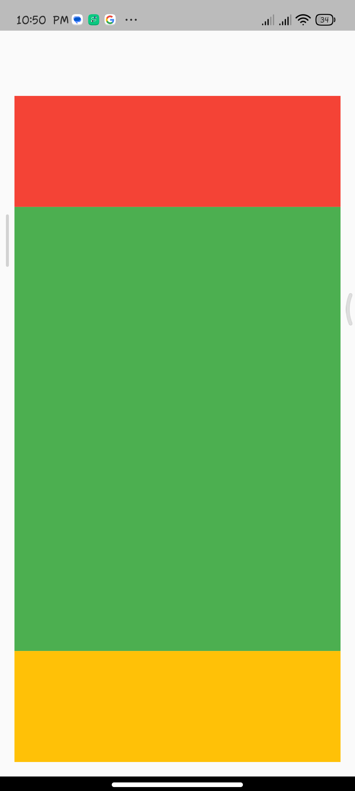
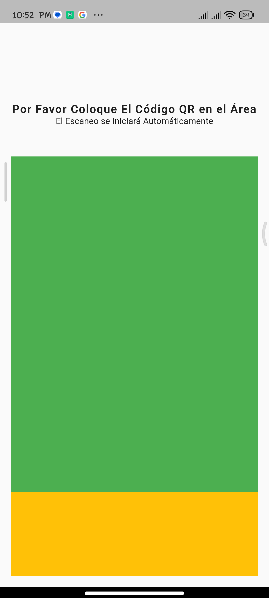
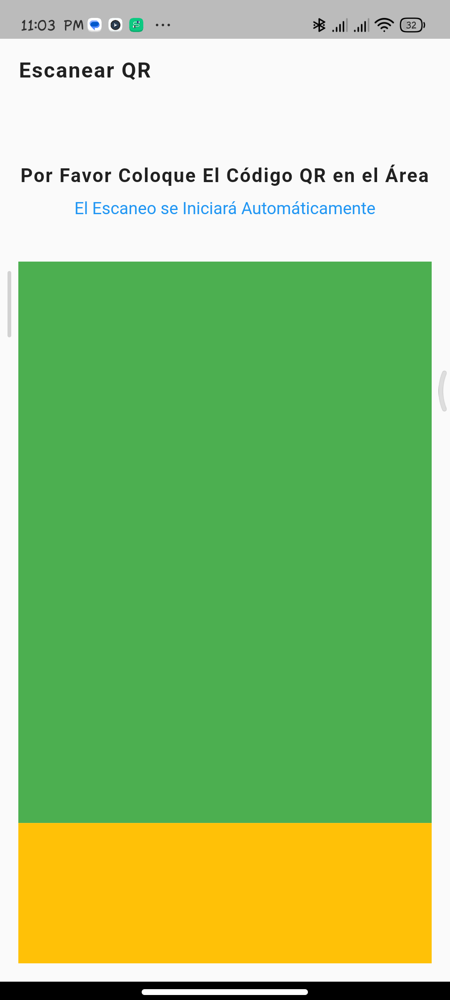
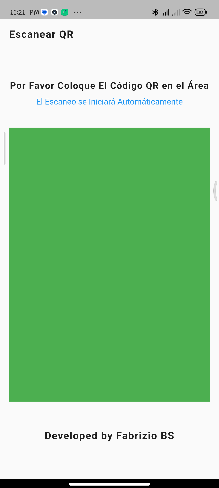
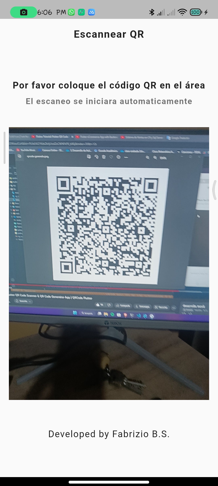
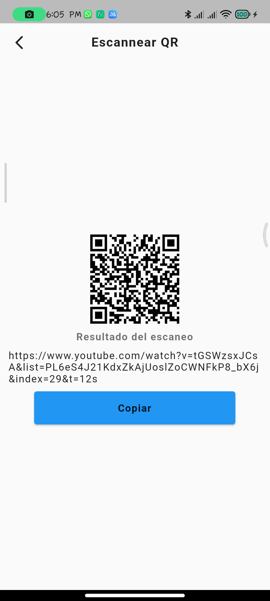

# scanner_qr

Mi primer Proyecto creado Con FLUTTER.

## Aplicación de escaneo de código QR y generador de código QR hecho con flutter

  <h5>VERSION 1.0.0</h5>
  
  
  
   
  
  
  

<h3><b>Realizado por:</b> Fabrizio Barrios Saavedra (RFBS19)</h3>
