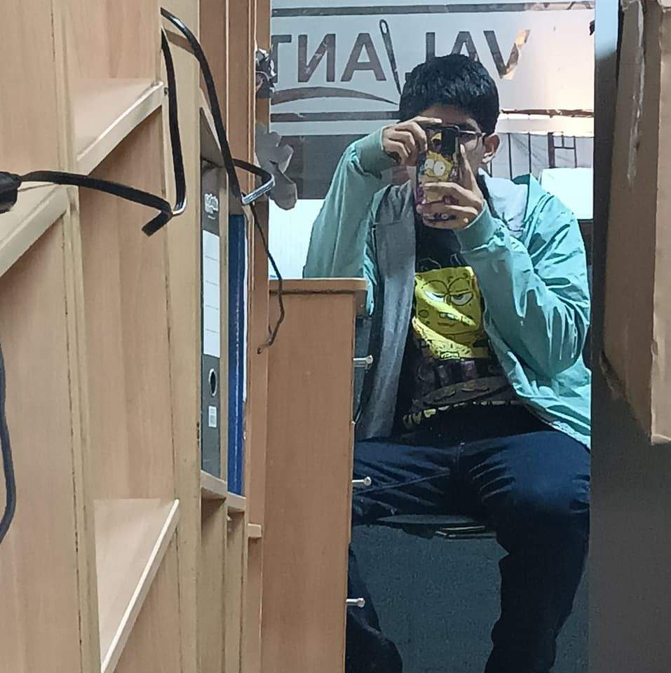

# 🚀 FabriScan - Escanea Códigos QR  

FabriQR es una aplicación desarrollada en **Flutter** que permite **escanear códigos QR y códigos de barras** de manera rápida y sencilla. Con una interfaz intuitiva y minimalista, facilita la lectura de códigos para abrir enlaces, acceder a información y más.

## 📸 Características  
✔️ Escaneo rápido de códigos QR y códigos de barras.  
✔️ Interfaz moderna y minimalista.  
✔️ Copia y apertura de enlaces escaneados en el navegador.  

## Soporte
Si tienes alguna pregunta o sugerencia, no dudes en contactarme a través de [fabriziobarrios92@gmail.com](mailto:fabriziobarrios92@gmail.com).
- **Autor**: Fabrizio Barrios Saavedra.
- **Portafolio**: [Mi Portafolio](https://portafolio-fabridev.vercel.app).
- **Mi Landing Page**: [FabriDev](https://fabridev.vercel.app/es)

## Licencia
Este proyecto está bajo la Licencia MIT - ver el archivo [LICENSE.txt](LICENSE.txt) para más detalles.

## Desarrollador

<h3><b>Aplicación Desarrollada por:</b> Fabrizio Barrios Saavedra (<a href="https://portafolio-fabridev.vercel.app" target="_blank">RFBS23</a> - <a href="https://fabridev.vercel.app/es" target="_blank">FabriDev</a>)</h3>

