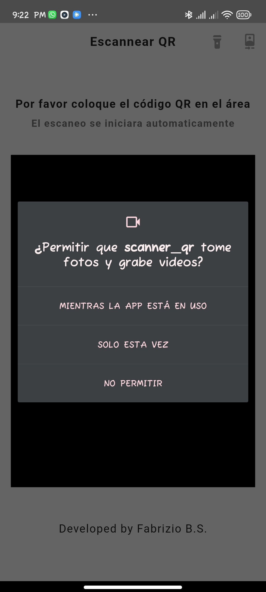
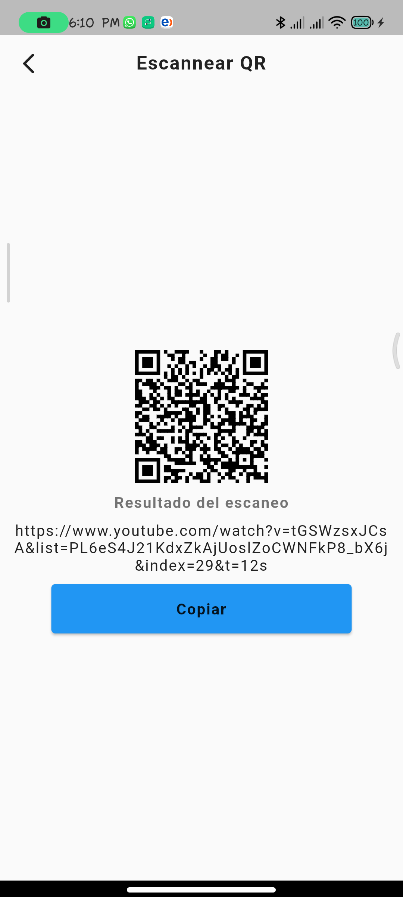
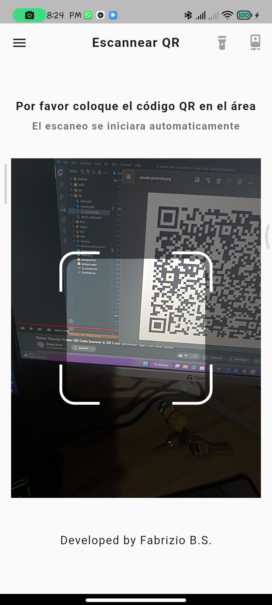
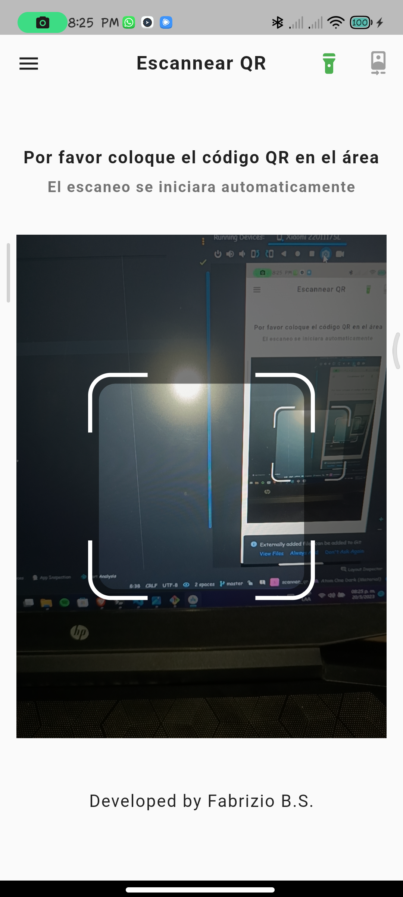
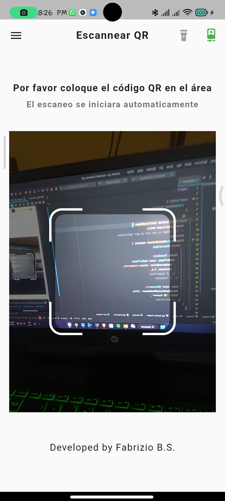
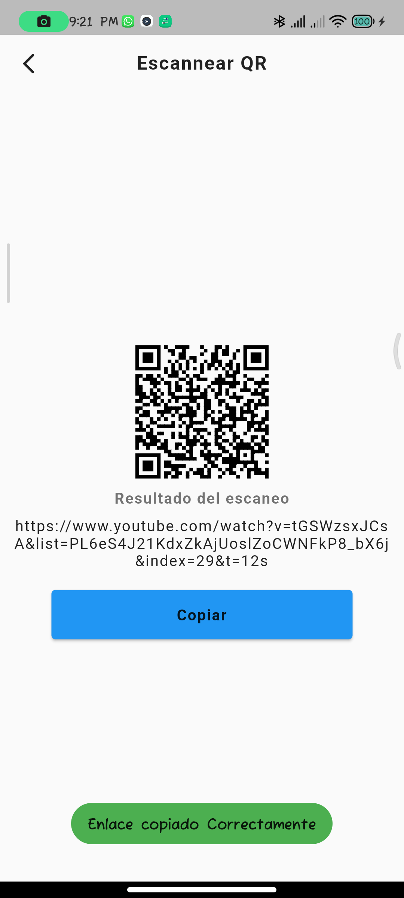

# scanner_qr

Mi primer Proyecto creado Con FLUTTER.

## Aplicación de escaneo de código QR y generador de código QR hecho con flutter

  <h4>Video de la Aplicacion</h4>
  https://github.com/RFBS23/Scanner_QR/assets/86460528/e9d3857c-2258-4daf-ad41-f62e0bd17d59
   
  <h5>VERSION 1.1.0</h5>
  
  
  
   
  
  
  
  <h5>VERSION 1.0.0</h5>
  
  
  
   
  
  
  

<h3><b>Aplicacion Desarrollada por:</b> Fabrizio Barrios Saavedra (RFBS19 - fabridev)</h3>

